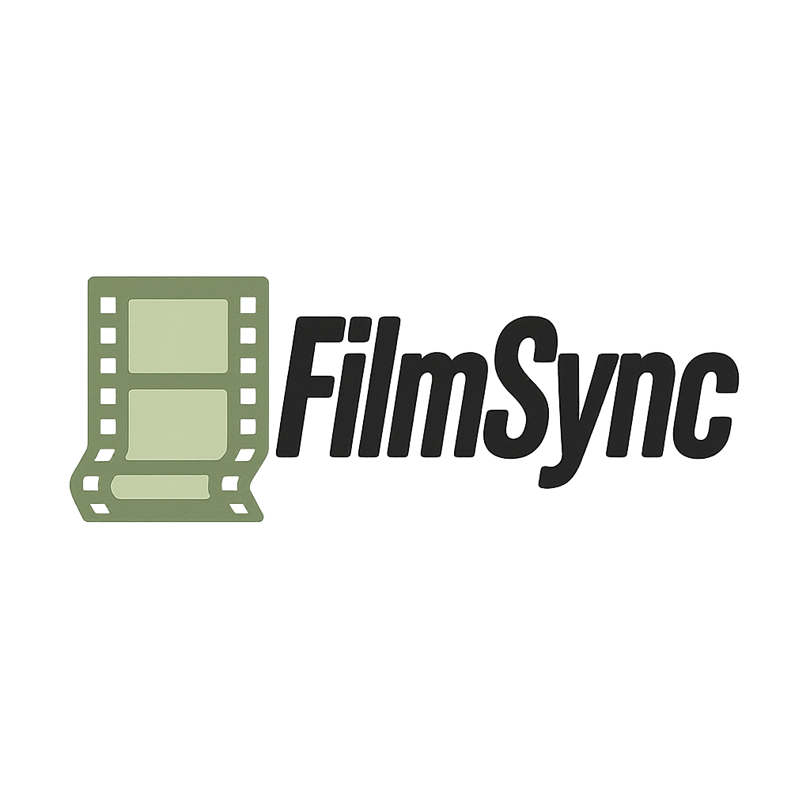

# FilmSync




A cross-platform desktop application to track and catalog movies, featuring a chatbot that recommends movies based on your collection. Built with C# and Avalonia UI.

## Features

- Add, view, and manage your movie collection  
- Store movie metadata using a SQL database (e.g., MariaDB or SQLite)  
- Chatbot integration for personalized movie recommendations  
- Cross-platform support: runs on Windows, Linux, and macOS  
- User account creation to support multiple users using the program


## Getting Started

### Prerequisites

- [.NET 8.0 SDK](https://dotnet.microsoft.com/en-us/download) or later  
- [MariaDB](https://mariadb.org/) or [SQLite](https://www.sqlite.org/index.html) (optional, for database)  
- [Avalonia Templates](https://avaloniaui.net/) installed

### Running the app

1. Clone this repository:

   ```bash
   git clone https://github.com/brisbie/FilmSync.git
   cd FilmSync
   ```

2. Restore dependencies and run:

   ```bash
   dotnet restore
   dotnet run
   ```

## Usage

- Use the UI to add and organize your movies.  
- Interact with the chatbot to get movie recommendations based on your catalog.

## Note

This is a personal project. Contributions, issues, or pull requests are not being accepted at this time.

## License

[MIT License](LICENSE)

---

*Built with Avalonia UI and .NET 8.0*
